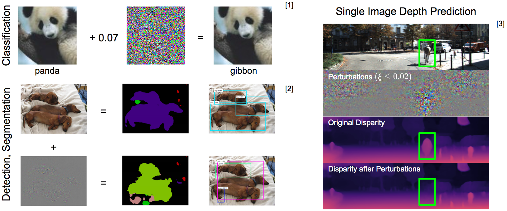
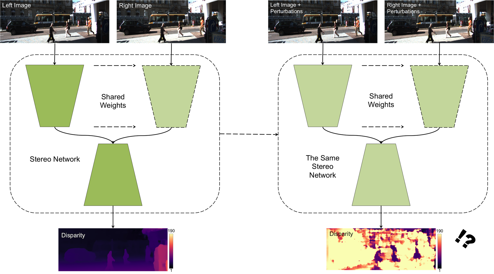
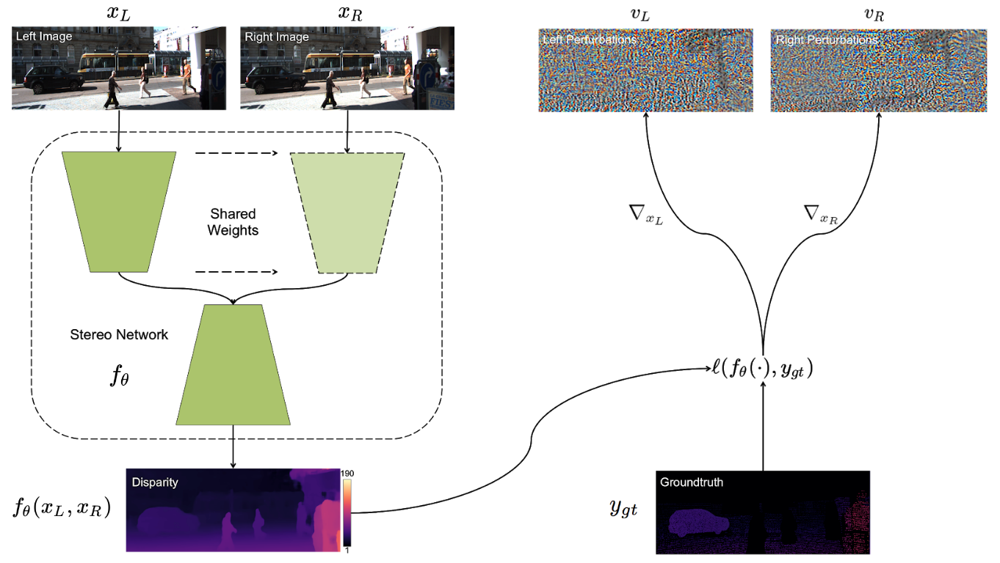

# Stereopagnosia: Fooling Stereo Networks with Adversarial Perturbations

PyTorch implementation of *Stereopagnosia: Fooling Stereo Networks with Adversarial Perturbations*

\[[arxiv](https://arxiv.org/abs/2009.10142)\]

Published in the Proceedings of AAAI Conference on Artificial Intelligence (AAAI) 2021

Authors: [Alex Wong](http://web.cs.ucla.edu/~alexw/), Mukund Mundhra

If this work is useful to you, please consider citing our paper:
```
@inproceedings{wong2021stereopagnosia,
  title={Stereopagnosia: Fooling Stereo Networks with Adversarial Perturbations},
  author={Wong, Alex and Mundhra, Mukund and Soatto, Stefano},
  booktitle={Proceedings of the AAAI Conference on Artificial Intelligence},
  volume={35},
  year={2021}
}
```
**Looking for our latest work?**

Check out our CVPR 2022 paper on [stereoscopic universal perturbations](https://github.com/alexklwong/stereoscopic-universal-perturbations) that generalizes across images, models and domains!

**Table of Contents**
1. [About adversarial perturbations](#about-adversarial-perturbations)
2. [About stereopagnosia](#about-stereopagnosia)
3. [Setting up your virtual environment](#setting-up-virtual-environment)
4. [Setting up your data directories](#setting-up-data-directories)
5. [Setting up pretrained models](#setting-up-pretrained-models)
6. [Optimizing adversarial perturbations](#optimizing-adversarial-perturbations)
7. [Transferring adversarial perturbations](#transferring-adversarial-perturbations)
8. [Ethical impact](#ethical-impact)
9. [Related projects](#related-projects)
10. [License and disclaimer](#license-disclaimer)

## About adversarial perturbations <a name="about-adversarial-perturbations"></a>

Adversarial perturbations are small signals that, when added to images, are visually imperceptible yet can cause the output of a deep neural network to change dramatically. and they have been studied extensively for single image based tasks such as classification, detection, segmentation, and depth prediction. For example, we know that a deep network can be fooled to mis-classify a panda as a gibbon, detect a dog as a train or a person, or even remove a biker from the 3D scene.

<p align="center">
    
</p>

This is not too surprising because there exists no unique minimizer for a single image. In other words, a single image does not constraint the latent or output of a network, the training set does. To infer the class or depth of an image, the network must rely on “transferring” prior knowledge from different scenes other than the one in question.

But can a network be “fooled” even if its output can be uniquely inferred?

## About stereopagnosia <a name="about-stereopagnosia"></a>

Let’s consider the task of estimating the 3D scene from a stereo pair.

A stereo pair consists of two images captured by cameras in known relative configuration, with non-zero parallax, projectively rectified so that corresponding points lie on corresponding scan-lines.

Stereo networks are functions that take as input a calibrated stereo pair and produce a depth map as output. Equivalently, the network can output disparity or the displacement between corresponding points in the two images, from which depth can be computed in closed form. Here we show a disparity map estimated using the stereo pair.

<p align="center">
    
</p>

Under fairly generic assumptions, stereo enables unique correspondences in covisible regions between a calibrated stereo image pair.
This means that a depth or disparity map can be uniquely inferred point-wise from the two images. Because disparity can be inferred without any learning, and without the need to transfer knowledge from other scenes, it would be surprising if small, imperceptible changes in the image can override the strong disparity signal.

Yet, Stereopagnosia shows just that: small perturbations in the image can force the network to overrule the evidence and forget stereoscopic disparity and as a result bias the solution in dramatic ways.

## Setting up your virtual environment <a name="setting-up-virtual-environment"></a>
```
virtualenv -p /usr/bin/python3 stereopagnosia-py3env
source stereopagnosia-py3env/bin/activate
pip install opencv-python scipy scikit-learn scikit-image matplotlib future yacs pandas gdown
pip install numpy==1.16.4 gast==0.2.2
pip install Pillow==6.1.0 torch==1.2.0 torchvision==0.4.0 tensorboard==1.14.0
```

In order to run the experiments for AANet, you will need to compile their deformable convolutions (deform_conv_cuda).

Because Ubuntu 20.04 ships with gcc8, you may have trouble compiling using their [instructions](https://github.com/alexklwong/stereopagnosia/tree/master/external_src/aanet#installation). 

For the ease of use, you can consider copying the binary that matches your system in 
```
external_src/aanet/nets/deform_conv/ubuntu1604
external_src/aanet/nets/deform_conv/ubuntu2004
```
into
```
external_src/aanet/nets/deform_conv
```
For example, when using Ubuntu 20.04 with python 3.7:
```
cp external_src/aanet/nets/deform_conv/ubuntu2004/deform_conv_cuda.cpython-37m-x86_64-linux-gnu.so external_src/aanet/nets/deform_conv
```

## Setting up your data directories <a name="setting-up-data-directories"></a>
Assuming you have the KITTI stereo flow (KITTI 2012) and KITTI scene flow (KITTI 2015) datasets:

```
mkdir data
ln -s /path/to/kitti_stereo_flow/ data/kitti_stereo_flow
ln -s /path/to/kitti_scene_flow/ data/kitti_scene_flow

python setup/setup_dataset_kitti.py
```

## Setting up pretrained models <a name="setting-up-pretrained-models"></a>
We have provided the implementations of AANet, DeepPruner and PSMNet in `external_src`. Each model can be accessed through their individual wrapper class (e.g. `src/aanet_model.py`, `src/deeppruner_model.py`, `src/psmnet_model.py`) or a unified wrapper `src/stereo_model.py`.

We have provided a setup script for each model that will download their pretrained models from their respective Google drives:

```
python setup/setup_model_aanet.py
python setup/setup_model_deeppruner.py
python setup/setup_model_psmnet.py
```

## Optimizing adversarial perturbations <a name="optimizing-targeted-adversarial-perturbations"></a>
You can run adversarial attacks against each model using `src/run_perturb_model.py`. The optimization process follows the following pipeline:

<p align="center">
    
</p>

For example, to attack PSMNet using FGSM:
```
python src/run_perturb_model.py \
--image0_path testing/kitti_scene_flow_image0.txt \
--image1_path testing/kitti_scene_flow_image1.txt \
--ground_truth_path testing/kitti_scene_flow_test_disparity.txt \
--n_height 256 \
--n_width 640 \
--output_norm 0.02 \
--perturb_method fgsm \
--perturb_mode both \
--stereo_method psmnet \
--stereo_model_restore_path pretrained_models/PSMNet/pretrained_model_KITTI2015.tar \
--output_path perturb_models/psmnet/fgsm/both_norm2e2 \
--device gpu
```

Additional examples of different attacks can be found in the `bash` directory.

To run FGSM on each stereo method:
```
bash bash/run_perturb_fgsm_aanet.sh
bash bash/run_perturb_fgsm_deeppruner.sh
bash bash/run_perturb_fgsm_psmnet.sh
```

To run I-FGSM on each stereo method:
```
bash bash/run_perturb_ifgsm_aanet.sh
bash bash/run_perturb_ifgsm_deeppruner.sh
bash bash/run_perturb_ifgsm_psmnet.sh
```

To run MI-FGSM on each stereo method:
```
bash bash/run_perturb_mifgsm_aanet.sh
bash bash/run_perturb_mifgsm_deeppruner.sh
bash bash/run_perturb_mifgsm_psmnet.sh
```

To run I-FGSM with diverse inputs on each stereo method:
```
bash bash/run_perturb_di2fgsm_aanet.sh
bash bash/run_perturb_di2ifgsm_deeppruner.sh
bash bash/run_perturb_di2ifgsm_psmnet.sh
```

To run MI-FGSM with diverse inputs on each stereo method:
```
bash bash/run_perturb_mdi2fgsm_aanet.sh
bash bash/run_perturb_mdi2ifgsm_deeppruner.sh
bash bash/run_perturb_mdi2ifgsm_psmnet.sh
```

## Transferring adversarial perturbations <a name="transferring-adversarial-perturbations"></a>
To transfer perturbations optimized for one network to another, you can run `src/run_transferability.py`.

For example, to transfer perturbations crafted for AANet using FGSM to DeepPruner:
```
python src/run_transferability.py \
--image0_path testing/kitti_scene_flow_image0.txt \
--image1_path testing/kitti_scene_flow_image1.txt \
--noise0_dirpath perturb_models/aanet/fgsm/both_norm2e2/noise0_output \
--noise1_dirpath perturb_models/aanet/fgsm/both_norm2e2/noise1_output \
--ground_truth_path testing/kitti_scene_flow_test_disparity.txt \
--n_height 256 \
--n_width 640 \
--stereo_method deeppruner \
--stereo_model_restore_path pretrained_models/DeepPruner/DeepPruner-best-kitti.tar \
--output_path perturb_models/aanet/fgsm/both_norm2e2/deeppruner \
--device gpu
```

Additional examples of different attacks can be found in the `bash` directory.

To run transfer perturbations optimized using FGSM:
```
bash bash/run_transfer_fgsm_aanet.sh
bash bash/run_transfer_fgsm_deeppruner.sh
bash bash/run_transfer_fgsm_psmnet.sh
```

To run transfer perturbations optimized using I-FGSM:
```
bash bash/run_transfer_ifgsm_aanet.sh
bash bash/run_transfer_ifgsm_deeppruner.sh
bash bash/run_transfer_ifgsm_psmnet.sh
```

To run transfer perturbations optimized using MI-FGSM:
```
bash bash/run_transfer_mifgsm_aanet.sh
bash bash/run_transfer_mifgsm_deeppruner.sh
bash bash/run_transfer_mifgsm_psmnet.sh
```

To run transfer perturbations optimized using I-FGSM with diverse inputs:
```
bash bash/run_transfer_di2fgsm_aanet.sh
bash bash/run_transfer_di2fgsm_deeppruner.sh
bash bash/run_transfer_di2fgsm_psmnet.sh
```

To run transfer perturbations optimized using MI-FGSM with diverse inputs:
```
bash bash/run_transfer_di2fgsm_aanet.sh
bash bash/run_transfer_di2fgsm_deeppruner.sh
bash bash/run_transfer_di2fgsm_psmnet.sh
```

## Ethical impact <a name="ethical-impact"></a>
As deep learning models are widely deployed for various tasks, adversarial examples have been treated as a threat to the security of such applications. While demonstrating that adversaries exist for stereo seems to add to this belief (since stereo is widely used in autonomous agents), we want to assure the reader that these perturbations cannot (and should not) cause harm outside of the academic setting. Cameras are not the only sensors on an autonomous agent, they are generally equipped with range sensors as well. Hence, corrupting the depth or disparity map will not cause the system to fail since it can still obtain depth information from other sources. Also, as mentioned in the paper, crafting these perturbations is computationally expensive and cannot be done in real time. Thus, we see little opportunities for negative ethical implications, but of course where there is a will there is a way.

More importantly, we see adversarial perturbations as a vehicle to develop better understanding of the behavior of black-box models. By identifying the input signals to which the output is most sensitive, we can ascertain properties of the map, as others have recently begun doing by using them to compute the curvature of the decision boundaries, and therefore the fragility of the networks and the reliability of their output.

What we want to stress in this work is that the mere existence of these perturbations tells us that there is a problem with the robustness of stereo networks. Therefore, we treat them as an opportunity to investigate and ultimately to improve stereo models. Our findings in the paper shed light on the benefits of harnessing adversarial examples and potential direction towards more robust representations.

## Related projects <a name="related-projects"></a>
You may also find the following projects useful:

- [Targeted Adversarial Perturbations for Monocular Depth Prediction][targeted_adversarial_perturbations_monocular_depth_prediction_github]: A method to fool monocular depth prediction methods into inferring a 3D scene of our choosing. The work is published in the Proceedings of Neural Information Processing Systems (NeurIPS) 2020.

- [VOID][void_github]: from *Unsupervised Depth Completion from Visual Inertial Odometry*. A dataset, developed by the authors, containing indoor and outdoor scenes with non-trivial 6 degrees of freedom. The dataset is published along with this work in the Robotics and Automation Letters (RA-L) 2020 and the International Conference on Robotics and Automation (ICRA) 2020.
- [XIVO][xivo_github]: The Visual-Inertial Odometry system developed at UCLA Vision Lab. This work is built on top of XIVO. The VOID dataset used by this work also leverages XIVO to obtain sparse points and camera poses.
- [GeoSup][geosup_github]: *Geo-Supervised Visual Depth Prediction*. A single image depth prediction method developed by the authors, published in the Robotics and Automation Letters (RA-L) 2019 and the International Conference on Robotics and Automation (ICRA) 2019. This work was awarded **Best Paper in Robot Vision** at ICRA 2019.

[targeted_adversarial_perturbations_monocular_depth_prediction_github]: https://github.com/alexklwong/targeted-adversarial-perturbations-monocular-depth
[void_github]: https://github.com/alexklwong/void-dataset
[xivo_github]: https://github.com/ucla-vision/xivo
[geosup_github]: https://github.com/feixh/GeoSup

## License and disclaimer <a name="license-disclaimer"></a>
This software is property of the UC Regents, and is provided free of charge for research purposes only. It comes with no warranties, expressed or implied, according to these [terms and conditions](license). For commercial use, please contact [UCLA TDG](https://tdg.ucla.edu).

## References
[1] I. Goodfellow, J. Shlens, C. Szegedy. Explaining and Harnessing Adversarial Examples. ICLR 2015.

[2] C. Xie, J. Wang, Z. Zhang, Y. Zhou, L. Xie, A. Yuille. Adversarial Examples for Semantic Segmentation and Object Detection. ICCV 2017.

[3] A. Wong, S Cicek, S. Soatto. Targeted Adversarial Perturbations for Monocular Depth Prediction. NeurIPS 2020.
